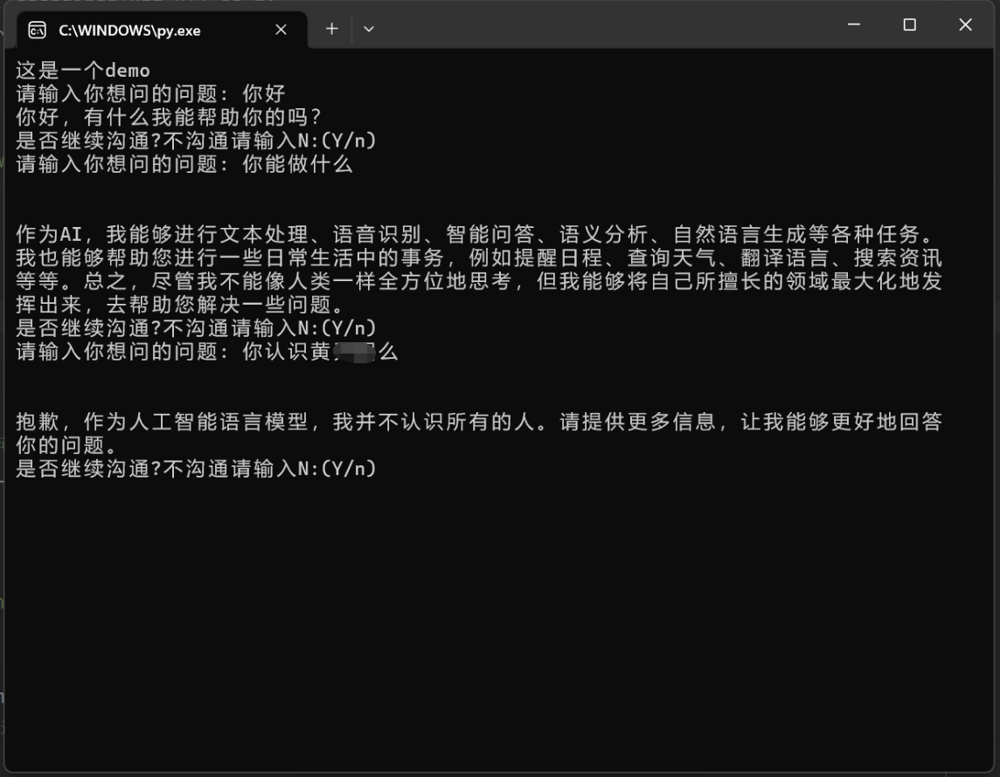

# 这是一个连接chatgpt的python文件

## 需要安装的包

已在python3.11环境下调试成功

需要安装一个包   pip install openai==0.27.0

## 需要修改得到内容

里面需要修改一些内容：

第六行、第七行需要修改：

```
os.environ["HTTP_PROXY"] = "你本地的代理ip:端口"
os.environ["HTTPS_PROXY"] = "你本地的代理ip:端口"

例如：
os.environ["HTTP_PROXY"] = "127.0.0.1:7890"
os.environ["HTTPS_PROXY"] = "127.0.0.1:7890"
```

第九行需要修改：

```
openai.api_key = "这里粘贴你的api-key"

例如：
openai.api_key = "abcd123123"
```


## 使用说明

修改内容完毕后，直接双击打开chatGPT-upload文件沟通即可：


样式举例：

